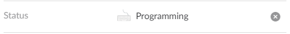

# Slack Status Setter

An Evening experiment.

Slack recently release a [new feature allowing you to set your status](https://slackhq.com/set-your-status-in-slack-28a793914b98). A colleague asked if it would be possible to automatically set their status to "in a meeting".

This lead me to think, why not update it for everything? This experiment answers that.

## Setup
1. Clone
1. `npm i`
1. Create `local.json` following the same format as `default.json`
    * Set your token to a valid [Legacy Slack API Token](https://api.slack.com/custom-integrations/legacy-tokens)
1. Run `ts-node src\index.ts`
1. You'll see logging every time the status is changed.

## Program Flow

This program does the following:
1. Query the active window's Application name
1. Match that name against a list of regular expressions
1. If a match is found, it sets your slack status to the match's status setting.

Some matching and delaying logic is in place but this is still likely to hit [Slack's Rate Limits](https://api.slack.com/docs/rate-limits).

## Future Work
1. Debounce / Sample:
    * We can be more intelligent here about when and what we're looking at:
        * What if I only tab to Chrome for less than a second?
        * What should happen if there is no Match?
    * We can delay or smooth out rapid changes of focus.
1. Combine the application name and title to identify Intent within an action
    * Am I watching Cat Videos?
    * Am I on GitHub?
1. Clear status on program exit.

